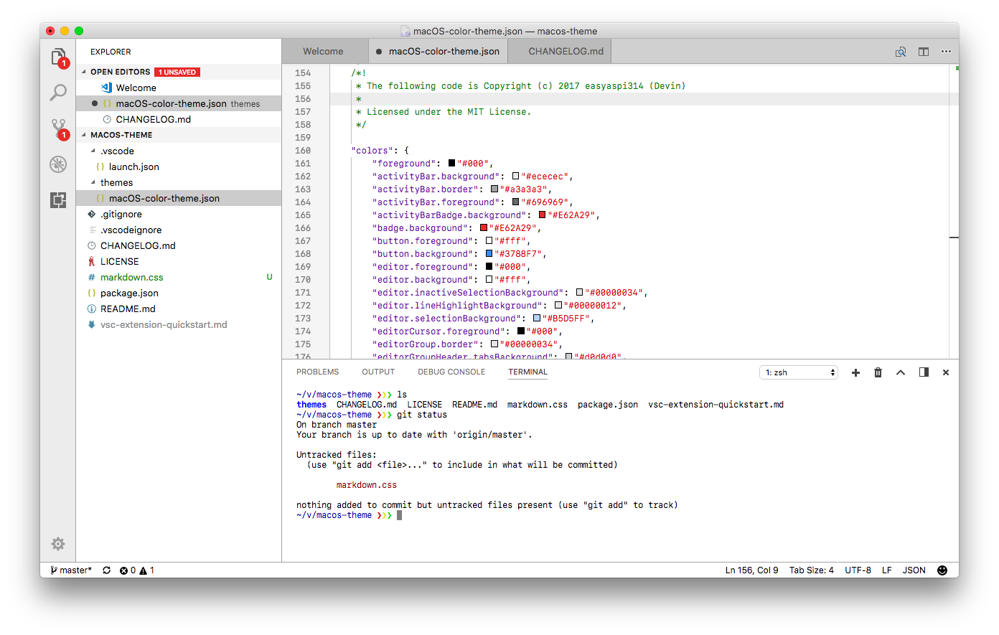

# macOS Theme for Visual Studio Code

GitHub source: https://github.com/easyaspi314/vscode-macOS



This is a macOS theme for Visual Studio Code. It is based off of the
[Xcode_default TextMate theme](https://github.com/crmne/xcode-default.tmtheme). 

For best results, add the following to your User Settings: 

```js
{
    // Tab close button on the left
    "workbench.editor.tabCloseButton": "left",
    // Remove icons on the tabs
    "workbench.editor.showIcons": false,
    // Basic theme for Markdown preview 
    // This doesn't seem to work for the extension gallery.
    "markdown.styles": [
     "https://rawgit.com/easyaspi314/vscode-macOS/master/markdown.css"
    ]
}
```
If you are on macOS, you should also add this:
```js
{
    // Use the native titlebar
    "window.titleBarStyle": "native",
    // Xcode's San Francisco Mono font. See below.
    "editor.fontFamily": "'SF Mono', Menlo, Monaco, 'Courier New', monospace"
}
```

To get Xcode's San Francisco Mono font installed, install Xcode, then open Finder.

Press Command+Shift+G, then paste this:
```
/Applications/Xcode.app/Contents/SharedFrameworks/DVTKit.framework/Versions/A/Resources
```

Now drag to select all of the SFMono-* fonts, double-click them, then select
Install to add SF Mono to your usable fonts. (You can also use it in other apps as well).

## License

My workspace colors are released under the MIT license, but as for the syntax theme, no license was
provided.